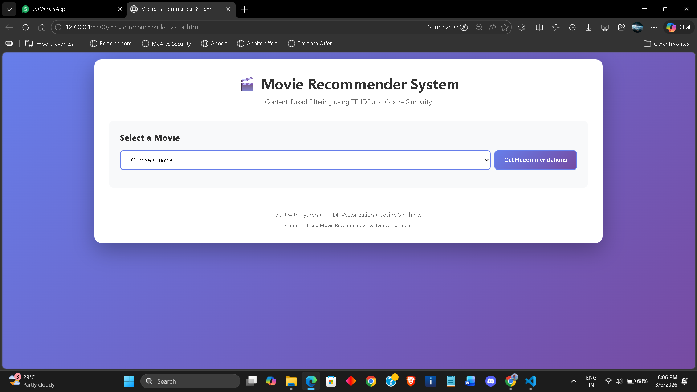
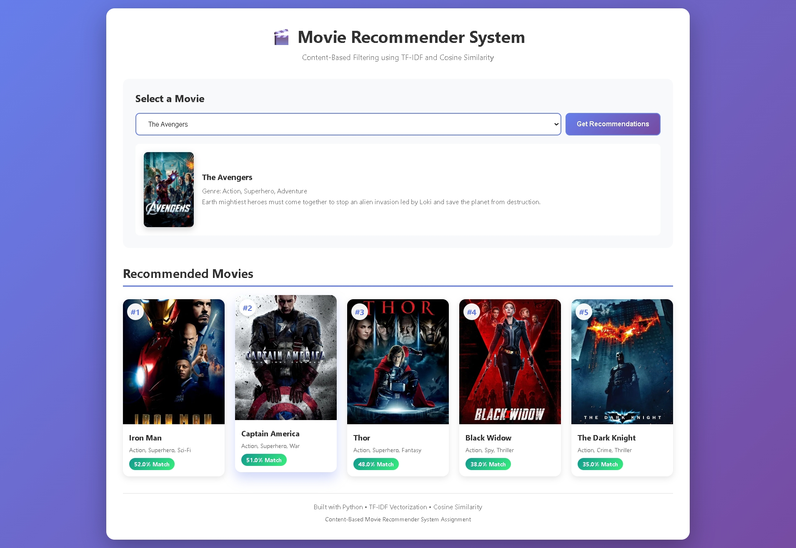

# 🎬 Movie Recommender System

A content-based movie recommendation system that suggests similar movies based on genre and overview using TF-IDF vectorization and cosine similarity.

## 🚀 Live Demo
Experience the live application here: Movie Recommender System on Vercel

## 🎓 Certification

This project was completed as part of the **Advanced Content-Based Recommender System Essentials Workshop** by **LetsUpgrade**, in collaboration with **NSDC** and **GDG MAD**.

- **Certification Date**: 6 March 2026
- **Focus**: Developing an intelligent Python-based recommendation engine using item features, user feedback, and advanced ML techniques

## 🌟 Features

- **Content-Based Filtering**: Recommends movies based on genre and plot similarity
- **TF-IDF Vectorization**: Analyzes movie descriptions to find patterns
- **Cosine Similarity**: Calculates similarity scores between movies
- **Interactive UI**: Beautiful, responsive web interface
- **Real-time Recommendations**: Get instant movie suggestions
- **Similarity Scores**: See how closely matched each recommendation is

## 📁 Project Files

- **`movie_recommender_system.py`** - Python implementation with TF-IDF and cosine similarity algorithm
- **`movie_recommender_visual.html`** - Interactive web interface for the recommendation system

## 🚀 Live Demo

Simply open `movie_recommender_visual.html` in your web browser to use the application.

## 📊 Dataset

The system includes 25 popular movies across different genres:
- Action & Superhero (The Avengers, Iron Man, Captain America, etc.)
- Romance (Titanic, The Notebook, La La Land, etc.)
- Sci-Fi (Inception, Interstellar, The Matrix, etc.)
- Crime (The Dark Knight, Joker, The Godfather, etc.)
- Animation (Toy Story, Finding Nemo, The Lion King, etc.)

## 🛠️ Technology Stack

- **Backend**: Python 3.x
- **Libraries**: scikit-learn (TfidfVectorizer), pandas, numpy
- **Frontend**: HTML5, CSS3, JavaScript
- **Algorithm**: TF-IDF (Term Frequency-Inverse Document Frequency)
- **Similarity Metric**: Cosine Similarity
- **Design**: Responsive gradient UI with modern styling

## 💻 How to Use

### Option 1: Web Interface

1. Clone this repository:
   ```bash
   git clone https://github.com/AshishCherian15/Movie-Recommender-System.git
   ```

2. Open `movie_recommender_visual.html` in your web browser

3. Select a movie from the dropdown menu

4. Click "Get Recommendations" to see similar movies

5. View the top 5 recommended movies with similarity scores

### Option 2: Python Script

1. Install required libraries:
   ```bash
   pip install scikit-learn pandas numpy
   ```

2. Run the Python script:
   ```bash
   python movie_recommender_system.py
   ```

## 🎯 How It Works

1. **Feature Extraction**: Combines movie genre and overview into a single text feature
2. **TF-IDF Vectorization**: Converts text into numerical vectors
3. **Cosine Similarity**: Calculates similarity between movie vectors
4. **Ranking**: Returns top 5 most similar movies with match percentages

## 📸 Screenshots

### Landing Page


### Movie Selection & Recommendations


The interface features:
- Clean, modern design with gradient background
- Movie selection dropdown
- Selected movie display with poster and details
- Grid layout of recommended movies
- Similarity percentage badges
- Ranking indicators

## 🔮 Future Enhancements

- Add more movies to the dataset
- Include user ratings and collaborative filtering
- Implement search functionality
- Add movie trailers and links
- Include cast and director information
- Save user preferences

## 👨‍💻 Author

**Ashish Cherian**

## 📝 License

This project is open source and available for educational purposes.

## 🙏 Acknowledgments

- Movie posters from The Movie Database (TMDb)
- Built as part of a content-based recommendation system program with **LetsUpgrade**, **NSDC**, and **GDG MAD**
- Special thanks to the workshop instructors and mentors
