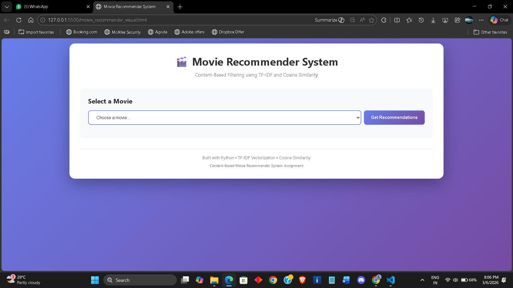
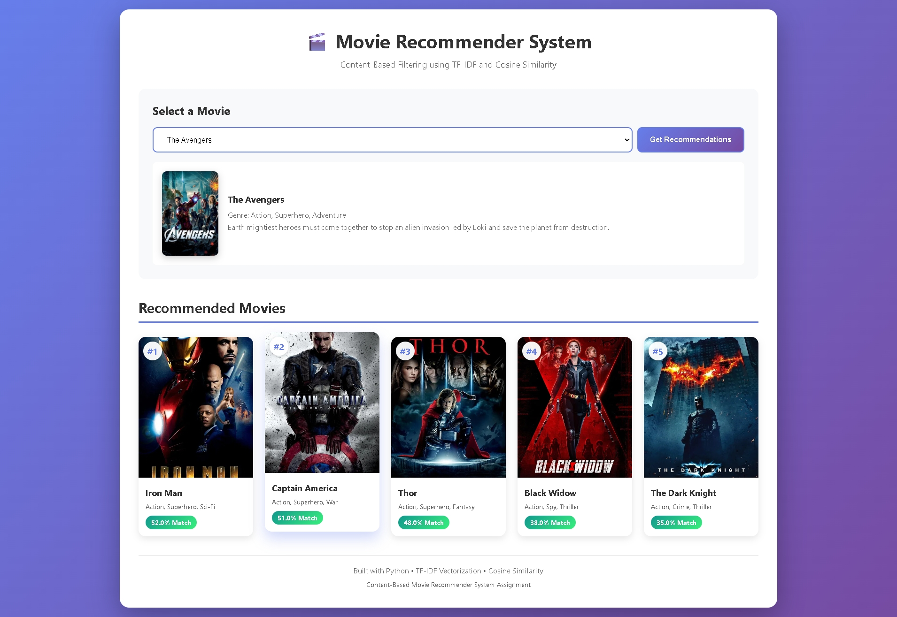

<h1 align="center">🎬 Movie Recommender System</h1>

<p align="center">
  
</p>

<p align="center">
  
  
  
  
</p>

---

## 📌 About This Project

This project is an **Advanced Bootcamp Assignment** from the **LetsUpgrade Content-Based Recommender System Essentials Workshop** (March 2026).

A **content-based movie recommendation engine** that intelligently suggests similar movies based on genre and plot descriptions using:
- **TF-IDF Vectorization** for text feature extraction
- **Cosine Similarity** for calculating movie similarity scores
- **Interactive Web UI** for seamless user experience
- **Real-time Processing** with instant recommendations

---

## 🌐 Live Demo

**Experience the recommender system here:**  
🔗 [Movie Recommender System on Vercel](https://movie-recommender-system-snowy.vercel.app/)

Simply select a movie and get personalized recommendations with similarity scores!

---

## 🎓 Bootcamp Certification

**Project Completed As:** Advanced Content-Based Recommender System Essentials Workshop Assignment

| Details | Information |
|---------|-------------|
| **Bootcamp** | LetsUpgrade Advanced ML Workshop |
| **Completion Date** | 6 March 2026 |
| **Certificate Number** | LUEARAFEB12640 |
| **Collaboration** | NSDC, ITM Edutech, GDG MAD |
| **Focus** | Content-based filtering, ML feature engineering, similarity metrics |

**Verify Certificate:** [www.letsupgrade.in/verify](https://www.letsupgrade.in/verify)

---

## ✅ LetsUpgrade Certificate Verification

**Certificate Holder:** Ashish Cherian  
**Organizer:** LetsUpgrade EdTech Pvt. Ltd.

### Verified Workshop Completion

| Workshop | Completion Date | Certificate ID | Collaborators | Status |
|---|---|---|---|---|
| Content-Based Recommender System Essentials Workshop | 6 March 2026 | LUEARAFEB12640 | NSDC, ITM Edutech, GDG MAD | ✅ Completed |

**Verification Link:** [www.letsupgrade.in/verify](https://www.letsupgrade.in/verify)

---

## 🌟 Features

- ✨ **Content-Based Filtering** — Recommends movies based on genre and plot similarity
- ✨ **TF-IDF Vectorization** — Advanced text analysis for feature extraction
- ✨ **Cosine Similarity** — Precise mathematical similarity calculation
- ✨ **Interactive Web Interface** — Beautiful, responsive UI for easy navigation
- ✨ **Real-time Recommendations** — Instant movie suggestions with scores
- ✨ **Similarity Scores** — Visual percentage badges showing match confidence
- ✨ **25+ Movie Dataset** — Diverse genres (Action, Romance, Sci-Fi, Crime, Animation)
- ✨ **Mobile Responsive** — Works perfectly on all devices

---

## 📸 Project Showcase

### Landing Page


*Clean, modern interface with gradient background and intuitive navigation.*

### Movie Selection & Recommendations


*Interactive dropdown with real-time recommendation generation and similarity badges.*

---

## 🎯 How It Works (Algorithm Breakdown)

The recommender system uses a **content-based collaborative approach**:

```
1. Feature Extraction
   └─→ Combines movie genre + plot overview into single text feature

2. TF-IDF Vectorization
   └─→ Converts text into numerical vectors (Term Frequency-Inverse Document Frequency)
       └─→ Identifies important keywords that distinguish movies

3. Cosine Similarity Calculation
   └─→ Computes similarity scores between selected movie and all others
   └─→ Formula: cos(θ) = (A · B) / (||A|| × ||B||)

4. Ranking & Return
   └─→ Sorts by similarity score (0.0 to 1.0)
   └─→ Returns top 5 most similar movies with percentage scores
```

**Why This Approach?**
- Doesn't require user ratings or behavioral data
- Purely content-based similarity
- Explainable recommendations (gender-neutral, bias-resistant)
- Fast computation
- Ideal for cold-start problems

---

## 📊 Dataset

The system includes **25+ popular movies** across diverse genres:

| Genre | Examples |
|-------|----------|
| **Action & Superhero** | The Avengers, Iron Man, Captain America, Thor |
| **Romance** | Titanic, The Notebook, La La Land, Pride and Prejudice |
| **Sci-Fi** | Inception, Interstellar, The Matrix, Avatar |
| **Crime & Thriller** | The Dark Knight, Joker, The Godfather, Pulp Fiction |
| **Animation** | Toy Story, Finding Nemo, The Lion King, Frozen |

---

## 🛠️ Technology Stack

| Component | Technology |
|-----------|-----------|
| **Backend** | Python 3.x |
| **ML Libraries** | scikit-learn (TfidfVectorizer), pandas, numpy |
| **Frontend** | HTML5, CSS3, JavaScript (Vanilla) |
| **Algorithm** | TF-IDF + Cosine Similarity |
| **Design** | Responsive gradient UI with modern styling |
| **Deployment** | Vercel |

---

## 💻 How to Use

### Option 1: Web Interface (Recommended)

1. **Open in Browser:**
   ```bash
   # Clone the repository
   git clone https://github.com/AshishCherian15/Movie-Recommender-System.git
   cd Movie-Recommender-System
   
   # Open the HTML file in your browser
   # Double-click: movie_recommender_visual.html
   ```

2. **Select a Movie from Dropdown** — Choose any movie from the list

3. **Click "Get Recommendations"** — Instantly see top 5 similar movies

4. **Review Results** — Check similarity percentages for each recommendation

### Option 2: Python Script (Advanced)

```bash
# Install required libraries
pip install scikit-learn pandas numpy

# Run the Python implementation
python movie_recommender_system.py

# Follow the prompt to enter a movie name
# Receive recommendations in terminal output
```

---

## 📁 Project Files

```
Movie-Recommender-System/
├── movie_recommender_system.py       (Python ML implementation)
├── movie_recommender_visual.html     (Interactive web interface)
├── index.html                         (Vercel deployment entry point)
├── LandingPage.png                    (UI screenshot - landing)
├── MovieOptions.png                   (UI screenshot - recommendations)
└── README.md                          (This file)
```

---

## 🔧 Implementation Details

### Python Backend (`movie_recommender_system.py`)

```python
from sklearn.feature_extraction.text import TfidfVectorizer
from sklearn.metrics.pairwise import cosine_similarity
import pandas as pd

# 1. Create feature matrix combining genre + overview
features = movies['genre'] + ' ' + movies['overview']

# 2. Vectorize using TF-IDF
vectorizer = TfidfVectorizer(stop_words='english')
feature_matrix = vectorizer.fit_transform(features)

# 3. Calculate cosine similarity
similarity_matrix = cosine_similarity(feature_matrix)

# 4. Get top 5 recommendations for selected movie
def recommend_movies(movie_name, top_n=5):
    idx = movies[movies['title'] == movie_name].index[0]
    scores = similarity_matrix[idx]
    top_indices = scores.argsort()[-top_n-1:-1][::-1]
    return movies.iloc[top_indices]
```

### Web Interface (`movie_recommender_visual.html`)

- Pure HTML5, CSS3, JavaScript (no dependencies)
- Real-time recommendation engine embedded
- Responsive gradient UI with hover effects
- Movie cards with similarity percentage badges
- Mobile-friendly design

---

## 🚀 Deployment

The project is **live and deployed on Vercel**:  
🔗 **Live URL:** [movie-recommender-system-snowy.vercel.app](https://movie-recommender-system-snowy.vercel.app/)

**Deployment Steps Used:**
1. Pushed to GitHub repository
2. Connected Vercel to GitHub
3. Vercel auto-detects HTML5 project
4. Deployed to global CDN with automatic updates

---

## 🎯 Key Learnings (Bootcamp)

✅ **Machine Learning Concepts**
- Feature extraction from unstructured text
- Vectorization techniques (TF-IDF)
- Similarity metrics and distance measures
- Model evaluation and recommendation ranking

✅ **Python Development**
- Data manipulation with pandas
- ML implementation with scikit-learn
- Building end-to-end pipelines
- Performance optimization

✅ **Full-Stack Integration**
- Backend-to-frontend data flow
- API-less architecture with embedded logic
- Interactive UI/UX design
- Responsive web implementation

---

## 🔮 Future Enhancements

- 📈 Expand dataset to 100+ movies with real TMDB API integration
- ⭐ Add user ratings and collaborative filtering
- 🔍 Implement search functionality with typo tolerance
- 🎥 Include movie trailers and IMDb links
- 👥 Add cast and director information
- 💾 Save user preferences and recommendation history
- 📊 Add analytics dashboard with recommendation insights

---

## 🏆 Why This Project Matters

This assignment demonstrates:
- **Practical ML implementation** beyond theory
- **End-to-end project execution** from algorithm to deployment
- **Real-world applicability** (recommendation systems power Netflix, Amazon, Spotify)
- **Full-stack capabilities** (Python backend → Web frontend)
- **Production-ready code** (deployed on Vercel, fully functional)

---

## 📝 License

This project is created as part of the LetsUpgrade Bootcamp curriculum and is available for educational purposes.

---

## 👨‍💻 Author

**Ashish Cherian**

- **GitHub:** [AshishCherian15](https://github.com/AshishCherian15)
- **LinkedIn:** [ashishcherian15](https://linkedin.com/in/ashishcherian15)
- **Bootcamp Certificate:** LUEARAFEB12640 (Verified at letsupgrade.in/verify)

---

## 🙏 Acknowledgments

- **LetsUpgrade Bootcamp** — For comprehensive ML curriculum and mentorship
- **NSDC & ITM Edutech** — For program collaboration and resources
- **GDG MAD** — For community support
- **The Movie Database (TMDb)** — For movie data and inspiration
- Workshop instructors and mentors for guidance

---

<p align="center">
  <strong>⭐ If you found this project helpful, please consider giving it a star on GitHub!</strong>
</p>

<p align="center">
  <em>Built with ❤️ as part of LetsUpgrade Advanced ML Bootcamp | March 2026</em>
</p>
